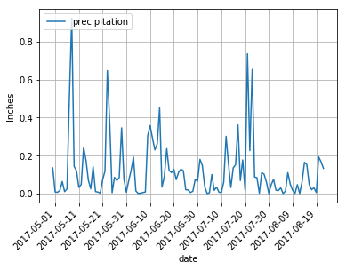
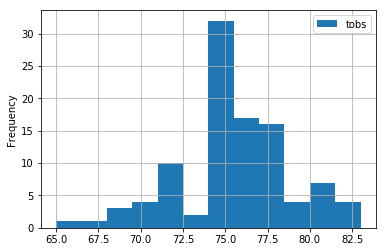
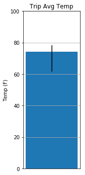

# Hawaii Climate Analysis and API

This project uses multiple python and SQL tools in order to provide an analysis and API off of Hawaii weather data between 2010 and 2017. The weather API contains 4 routes (see climate_app.ipynb):

1. /api/v1.0/precipitation : shows dates and temperature observations from the last year
2. /api/v1.0/stations : returns a list of weather stations
3. /api/v1.0/tobs : returns a list of temperature observations (tobs) from the last year
4. /api/v1.0/<start> and /api/v1.0/<start>/<end> : returns a list of min, avg, and max temperature for the specified range

Tools: Jupyter Notebook, Python, SQLite, APIs

Libraries: SQLAlchemy, flask, pandas, matplotlib

#### Matplotlib Graphs

Code for graph generation is within climate_analysis.ipynb

##### Precipitation over Time

##### Station Analysis

##### Avg Temp for 4/1/17-6/1/17

